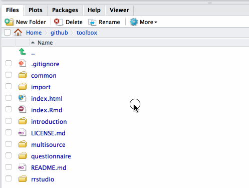
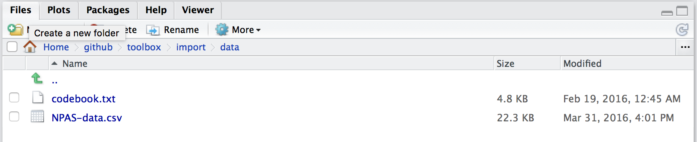
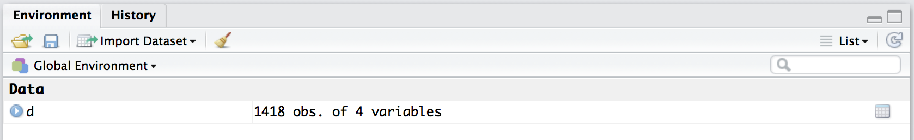
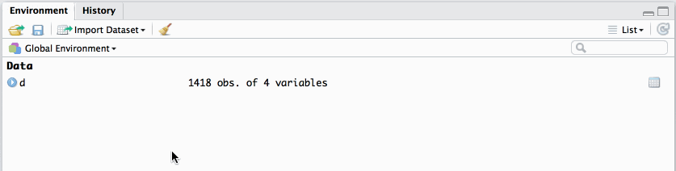
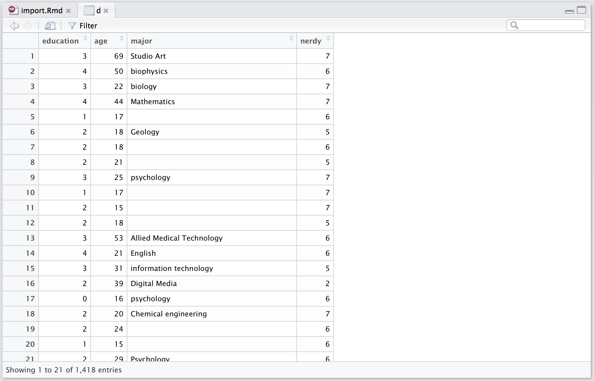

```{r chunk_opts, echo=F, warning=FALSE, message=FALSE, results = 'hide'}
source("common/chunk_opts.R")
```

# Introduction

In SPSS or Excel, importing data is fairly self-explanatory: The user clicks through various menu items to locate the relevant data file in the computer's hard drive, and opens the file. In R, the analoguous operation is to _import data to the environment_ (the environment is just an abstract collection of objects that R has access to.) Here, we'll locate data on the hard drive using RStudio's file dialogue, import the file to the workspace, and print its content's in the console. After learning how to work with a single source data file, we'll cover how to import multiple source data files to R and combine them into a single object. 

# Single source data file

This example data is a file downloaded from <http://personality-testing.info/_rawdata/>, and contains answers to the [Nerdy Personality Attributes Scale](http://personality-testing.info/tests/NPAS/), along with some demographic variables. I have removed some variables from the file that are not relevant for the present purposes.

## Locating the data file

If you have downloaded the toolbox materials, the relevant folder for this tutorial is `/toolbox/`. So, we can fire up RStudio and navigate to the folder using RStudio's file navigator, and set it as the working directory:



The data file is in `/toolbox/data/nerdy/` and is called `NPAS-data.csv`. The `.csv` extension means that the data are in a Comma Separated Values format, which is a common format for data; any Excel spreadsheet, for example, can be exported as a `.csv`, and both Excel and SPSS can open `.csv` files. There is also a `codebook.txt` file, detailing what the various variables in the `.csv` file mean.



It's important to recognize that R only looks for external files in the current working directory. You can see the current working directory on top of the R console, or print it in the console by typing `getwd()` and pressing `return`:


Your working directory will be slightly different, because the default printout includes the username and other preceding folders.

## Importing the data file

Now that we know the location and name of the data file, and the current working directory, we can ask R to read the `.csv` file from the `data/` folder by using the relative path to the file. To read files to the R environment, we need a function that does just that: `read.csv()`. 

```{r read_csv}
d <- read.csv("data/nerdy/NPAS-data.csv")
```

The above function, `read.csv()` takes multiple arguments, but for the present purposes we only passed the location and name of the file to it, as a text string, and save the function call to `d`. `d` now contains the contents of the `.csv` in a format that R understands, namely, it is a `data.frame`.

Why did we write `read.csv("data/nerdy/NPAS-data.csv")` instead of `read.csv(data/nerdy/NPAS-data.csv)`? Enclosing a string of text into quotation marks in R means that you are referring to a _string_ of text, which is appropriate in this case. If you leave out the quotation marks, R thinks that you are talking about an object, which is not found in the R environment.

As a result of executing `d <- read.csv("data/nerdy/NPAS-data.csv")`, there is now an _object_ in the R environment, called `d`:



## Show me the data

Now that `d` is in the R environment, we can look at it in various ways. If you click on the little blue arrow next to `d` in the Environment pane, you'll get a quick overview of what `d` contains:



First, you'll see that there are 1418 observations (rows) and 4 variables (columns). Clicking the arrow reveals the names, types, and first 10 values of each of these columns. Clicking on `d` itself (in the Environment pane) opens up the data viewer, which is very useful for looking at the data in a format familiar from SPSS and Excel:



This view reveals more of the actual values of the variables, and you can scroll up and down to inspect the entire `data.frame`.

Finally, we'll view the data within the R console, by typing a few simple commands. There are two very useful functions to quickly look at the data: `str()` and `head()`. `str()` prints out the structure of the `data.frame`:

```{r str}
str(d)
```

And `head()` shows the first six rows of the `data.frame`:

```{r head}
head(d)
```

You could also print out the entire contents of the `data.frame`, but 1418 rows would result in an information overflow, so I won't show the results of doing that. You can try it by typing `d` in the console, and hitting `return`.

```{r d, eval=F}
d
```

<small>`results not shown`</small>

## Figure 

Usually, the best way to investigate data is by looking at figures. I'll draw one here, but won't reveal the code quite yet, as plotting is covered in later tutorials. By following through the toolbox tutorials, you'll be able to draw similar plots in no time!

```{r, echo = F, fig.cap = "Mean nerdiness (±1 SEM) for most common majors."}
library(dplyr)
library(ggplot2)
d$major <- tolower(d$major)
group_by(d, major) %>%
    mutate(n = n()) %>%
    filter(n > 7 & n < 500, major != "#name?") %>%
    summarise(Nerdy = mean(nerdy),
              n = n(),
              nerdy_se = sd(nerdy, na.rm=T) / sqrt(n)) %>%
    mutate(major = reorder(major, Nerdy)) %>%
    ggplot(aes(x = Nerdy, y = major)) +
    geom_point() +
    geom_errorbarh(aes(xmin = Nerdy - nerdy_se, xmax = Nerdy + nerdy_se)) +
    geom_point(data = filter(group_by(d, major) %>%
                        summarise(Nerdy = mean(nerdy),
                        n = n(),
                        nerdy_se = sd(nerdy, na.rm=T) / sqrt(n)), 
                        major == "psychology"), 
               col = "red", size = 4) +
    scale_y_discrete("Major", expand = c(0.01, 0.01)) +
    scale_x_continuous(expand = c(0, 0.01), limits = c(3, 7)) +
    theme(axis.title.y = element_blank())
```

Psychology, highlighted in red, sits comfortably in the middle. Of interest is also the fact that people who reported their major as "_math_" instead of _mathematics_ reported lower nerdiness scores, although they have the same major.

Now that we've covered working with a single source data file, we'll move on to multiple source data files.

# Multiple source files

In psychology, it is common to have multiple source data files that need to be combined for statistical analyses. For example, an experiment might produce a data file for each participant: In this case, the shape of the data is always the same (same variables collected on every participant, and possibly an equal amount of observations [rows]). Another example is a multi-site project, where, for example, multiple investigators collected personality questionnaires in various countries. Again, these files need to be combined for analyzing each country's data together. I'll use this latter case as an example.

In this example, we'll learn to work with multiple source data files using the same data as in the [questionnaire data project](questionnaire.html). These data are responses to the Big Five personality questionnaire from over 100 countries, and are freely available [here](http://personality-testing.info/_rawdata/) (open data wins again!).

## Show your work

In order to analyse all the data in R (or any other program), the files need to be combined into one object within the programming environment. Additionally, we can create a shortcut for later analyses by saving this "master" data object into a file. However, it is crucial that you don't just save this new master file, but also the first step in the data analytic pipeline: The merging of multiple source files. After all, it is possible that we commit an error at this stage, and if we haven't detailed what happened at this stage, we will not know what that error was, or how it influenced the data we analysed. Therefore, I generally recommend only saving the R script that produces master data frames from raw data, not the resulting master data file. If the merging step takes a long time (and it won't if you have fewer than a million observations), then you may also save the master data file, and load it on subsequent analyses of data instead of running the merging script every time. In any case, the merging script __must__ be saved as well. This constitutes the first note on the paper trail we leave for future investigators, including your future self. Now that we're motivated to begin a reproducible workflow, let's locate the files.

## Locating the files

The raw data downloaded from the [website](http://personality-testing.info/_rawdata/BIG5.zip) is a neat and simple spreadsheet, but for our purposes, I've split the data into separate files by country. To look at the source files, we use the `list.files()` function that simply takes a path as input, and shows what's in that path. These data are located in `data/countries/`.

```{r}
file_path <- "data/big5/countries/"
list.files(file_path)
```

We would certainly like to avoid manually copying and pasting these files into one master file in Excel. Fortunately, programming allows us to [DRY](https://en.wikipedia.org/wiki/Don't_repeat_yourself), and we can load and merge these data with a few lines of code. 

Before we begin, make sure that your working directory is set: It should be the `toolbox/` folder:

```{r}
getwd()
```

If this is not correct, use the file navigator in RStudio and click on "Set as working directory" when you are in this folder (note that the folders preceding `/toolbox/` are different on your computer).

## Merging two data files

The first step is to investigate what the shape of the data is, so let's read and investigate a single source file, the Big Five questionnaire responses from Papua New Guinea. Above, when dealing with a single source file, we used `read.csv()` to import .csv files into R. But here I will use another function, from the __readr__ package [@wickham_readr:_2015], because it will prove to be more flaxible later on. Using it is equally easy (but make sure it is [installed](rrstudio.html).)

```{r}
library(readr)  # For enhanced data file reading functions
pg <- read_csv("data/big5/countries/PG.csv")
pg
```

To learn about what I called the **shape** of the data, we need to know its dimensions. These are listed on top of the displayed output, above. The object `pg` is a data frame with 2 rows and 57 columns. Each row is an observation, and each column is a variable. The easiest merging operation would be to add more rows to this data from a data frame that has the same columns, such as the data collected in Guatemala:

```{r}
( gt <- read_csv("data/big5/countries/GT.csv") )
```

Note how I enclosed the line of code in parentheses. By doing so, I asked R to evaluate the code _and_ print out the resulting object. Neat. 

This data frame also has 57 columns, and both data sets are two-dimensional[^1]. To merge these data sets, we simply need to bind them by row. But before we merge data frames, we need to be sure that the columns mean the same thing in both. One way to do this is to inspect the names of the columns, and make sure that they match up. The `names()` function returns the column names of the data frame, and we can compare the names of two data frames by comparing them with the logical `==` (equals) operator:

```{r}
names(pg) == names(gt)
```

The equality between each column name in `pg` and `gt` is `TRUE`. This is machine language for: "Stuff's the same." We can therefore proceed and bind the data frames by row. For this task, Rs built-in `rbind()` is the right tool:

```{r}
rbind(pg, gt)
```

Job done! Kind of... Although `rbind()` does its job well, we instead turn to another gem from the __dplyr__ package [@wickham_dplyr:_2015]: `bind_rows()`. This function allows us to do more complex operations, such as joining _lists_ of data frames, without extra complications, and is therefore preferred:

```{r}
(pg_and_gt <- bind_rows(pg, gt))
```

Great! Although we were able to efficiently combine two source data files with this procedure, many projects, such as this one, can have hundreds of source data files, and we wouldn't want to write out `read_csv("XX.csv")` for each of the files separately. Therefore we'll _write a function_ that reads an arbitrary number of data files into a single object!

## Merging more than two data files

A common task, such as this one, has of course been solved many times over, and we shouldn't be wasting our time reinventing the wheel. We therefore will use a [function that another R user has already shared](https://gist.github.com/crsh/357458c41fd3d554fb24) on the excellent open-source programming platform [GitHub](https://github.com/). 

### Creating a function

What follows is based on [this function]((https://gist.github.com/crsh/357458c41fd3d554fb24)), but I've tweaked it a little bit. First, here is what the function looks like:

```{r, echo = F}
batch_read <- function(path, extension) {
  file_names <- list.files(path, pattern = extension)
  data_list <- lapply(paste0(path, file_names), read_csv)
  data_frame <- bind_rows(data_list)
  data_frame 
  }
```

```{r}
batch_read  # Call a function without () to show the methods it contains
```

Perhaps you can intuit that this function executes all the steps we already did above, but instead of merging two files, the function can merge a whole list of files! The printout above describes `batch_read()` as a _function_ that takes two arguments: `path` and `extension`. When this function is executed, it first lists files in `path` whose filename include `extension`. This is extremely helpful, because the function now only reads files that have our pre-specified extension, and ignores all other file types. This list of file names is saved to `file_names`. 

The second line is a little more complicated, but not much! (One reason it looks more complicated than it is has to do with [nesting functions vs. piping functions](questionnaire.html)). The innermost function `paste0()` concatenates multiple text strings together, without spaces (hence `paste0` instead of `paste`):

```{r}
string1 <- "Hello"
string2 <- "world!"
paste(string1, string2)
paste0(string1, string2)
```

Because `path` is a text string, and `file_names` is a list of text strings, the result is a new list of text strings. The result of `paste0(path, file_names)` is then passed to `lapply()`, which simply means _list apply_. `lapply()` takes as its first argument a list, here the list of file names. The second argument to `lapply()` is the function to apply to the list: We want to `read_csv()`. This line, therefore, _reads a list of csv files_, and saves the list into `data_list`: A list containing a whole bunch of data frames create by repeatedly applying `read_csv()` to file names in the list of names. 

A final step remains: The list needs to be unpacked into a data frame. Above, I alluded to how `bind_rows()` does all sorts of neat things. Well, this is just one of those things, we simply passed the list of data frames (`data_list`) to `bind_rows()`, which then created a single object (called `data_frame`). The last line of the function definition specifies what is to be returned when a user calls this function.

I said before that programming is hard. You learn it by doing it. The preceding discussion is abstract and elusive and we will learn faster by implementing the function ourselves. To create this function, type the following code into your R script, and run it:

```{r}
batch_read <- function(path, extension) {
  file_names <- list.files(path, pattern = extension)
  data_list <- lapply(paste0(path, file_names), read_csv)
  data_frame <- bind_rows(data_list)
  data_frame
}
```

If you now look at your Environment pane in RStudio, you'll see `batch_read` under the __Functions__ label. You can now call this function by typing in `batch_read(folder_where_revolutionary_data_lives, file_extension)`. Brilliant!

### Read multiple files with `batch_read()`

Let's put our shiny new `batch_read()` to use and load our data. Recall that `file_path` is an object that simply contains, as a text string, the folder where the country-specific data files are: `r file_path`

```{r}
d <- batch_read(file_path, ".csv")
```

There! We read all the .csv files in `file_path` (`r file_path`). If we would like to save the new master data file as a single .csv, we could run the following code (but recall the discussion above about _not saving intermediate data files, but only the *procedure* that generated those data files_):

```{r, eval = F}
write_csv(d, path = "data/big5/master-data.csv")
```

### View combined data

`d` now contains all the Big Five questionnaire responses, from all the data files:

```{r}
d
```

To get to work with this data, take a look at the [questionnaire data tutorial](questionnaire.html).

# Bonus round

This was a pretty boring, but important, project, so let's do something fun at the end. The country names in `d` are two letter codes ([ISO 3166-1 alpha-2](https://en.wikipedia.org/wiki/ISO_3166-1_alpha-2) codes, specifically): 
```{r}
c(unique(d$country)[1:20], "...")  # Print first 20 ISO2 labels and an ellipsis
```

It would be very informative if we could convert them to actual country names. Well, [there's an R package for that](https://www.youtube.com/watch?v=yhTerzNFLbo):

```{r}
library(countrycode)                                    # Install if necessary
d$country <- countrycode(sourcevar = d$country,         # Source variable
                         origin = "iso2c",              # Coding scheme
                         destination = "country.name")  # I want their names!
c(unique(d$country)[1:20], "...")  # Print again
```

And finally, we'll print out some arbitrary plot, and you should try to figure out what the code here does. If you are unsure about all the `mutate()`s etc. please refer back to the [questionnaire data project](questionnaire.html).

```{r}
filter(d, !is.na(country)) %>%
    group_by(country) %>%
    mutate(N = n()) %>%
    ungroup() %>%
    filter(N > 100) %>%
    mutate(country = reorder(country, N)) %>%
    ggplot(aes(x = N, y = country)) +
    geom_point()
```

[^1]: Two-dimensional data simply means that it has rows and columns. One-dimensional data would be a vector: A simple sequence of values. By and large, we deal with two-dimensional data (such as you see when you stare at an Excel spreadsheet), but data can take any number of dimensions. Think about what three-dimensional data would look like.

# References

Great info here: http://r4ds.had.co.nz/import.html
