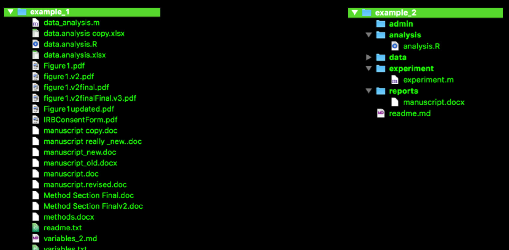

```{r chunk_opts, echo=F, warning=FALSE, message=FALSE, results = 'hide'}
source("common/chunk_opts.R")
```

# Introduction

For this project we'll be using a real data set, consisting of 19,719 individual's responses to 50 questionnaire items that together constitute the Big Five personality scale. Additionally, each respondent provided their gender, age, race, native language and country. With this many respondents, items responded to, and categories by which we can split the responses, we can get answers to a rich set of questions. The data set is available [here](http://personality-testing.info/_rawdata/BIG5.zip), and you can complete the scale yourself on [this website](http://personality-testing.info/).

Before we begin wrangling the data, we'll go through an important topic: Project Organization.

# Organizing a Project

While there is no single way to organize a project that would fit every situation, it is imperative that every project have some organizing principles that help the participants in the project find and execute the files within the project. Therefore, before the project is initiated, you need to think about what it is about, what are the likely inputs (e.g. "spreadsheet" type data files, large scale databases, photographs, biological samples) and outputs (e.g. manuscripts, data figures, presentations.) These considerations will heavily narrow down the possible ways in which the project can be organized. 

We will be working with a fairly simple, but I think common, situation where we have one "spreadsheet" like data file, intend to keep this file on one computer, and produce figures and simple reports from the data. Therefore, we'll set out to define a clear folder structure for our files. A folder structure helps us keep track of our files, ensure that we know what are the inputs (never overwrite / edit the source data!) and how to turn the inputs into outputs. The folder structure I've chosen for this project is displayed below:

```bash
toolbox
|-- questionnaire.Rmd  # This file!
|-- data
|   |-- big5
|       |-- data.csv
|       |-- codebook.txt
```
<small>This is not the only "correct" structure, but something that makes sense to me and is easy to explain to others. By all means in your own projects use one that suits your needs better.</small> 

I view a clear folder structure as the first step toward a reproducible research project. By adhering to a simple scheme like this, my future collaborators--including myself!--will almost immediately know how to locate any files they need to do their jobs. If I end up collaborating with you, and your project looks like the figure on the left, below, I _will_ call you at 3am and ask you to fix it asap. The one on the right gives an idea of what a good organization might look like.



If you downloaded all of the [Toolbox 2.0](https://mvuorre.github.io/toolbox/) materials, you already have this file structure ready under the root folder `/toolbox/`, and can now browse your way to these folders on your computer, and inspect their contents. 

# Prepare a session in RStudio

Before we can access the data in RStudio, we need to set the working directory. Do __not__ set working directories in your script, because these calls make others with different root folder structures (usernames, systems, etc.) unable to run your script without changing these arguments. Instead, you can simply click the Set As Working Directory button in RStudio (under the "More" button.)

The raw data downloaded from the [website](http://personality-testing.info/_rawdata/BIG5.zip) is a neat and simple spreadsheet of data, which we will load into the R workspace.

# Load the data

The first step is to load the source data file into the current R environment, or workspace. To load the data, we use a function called `read_tsv()` from the `readr` package [@wickham_readr:_2015]. `read_tsv()` takes _tab-separated_ data tables as input, which is appropriate in this case.

```{r load-big5, eval = T, cache = F}
library(readr)  # Loads the readr package into the current workspace
d <- read_tsv("data/big5/data.csv") 
d <- na.omit(d)  # Remove all missing values
```

Usually at this stage you would probably already know quite a bit about the data, if you collected it yourself. Here we get familiar with the data for this example: The data consist of responses to the Big Five personality questionnaire, and we have indicator variables for the country, age, sex, race, etc. of the respondent. Plenty to explore!

>This data was collected (c. 2012) through on interactive online personality test. Participants were informed that their responses would be recorded and used for research at the begining of the test and asked to confirm their consent at the end of the test.

You can simply type the name of the object (`d`) in the r console to print it (only 10 first columns shown below):

```{r printbig5, echo = F, cache = F}
kable(head(d[,1:10]))
```

We have a `data_frame` named `d` that contains 19710 observations on 57 variables: Each variable is contained in a column, with the top entry (`race`, `age`, ...) giving names to the variables.

# Recode and summarise variables

Now that we're a little more familiar with the data, we can begin to manipulate it. Here, we'll

* [recode variables](#Recode_variables)
    * new tool: `mutate()`
* [obtain basic summaries of categorical variables](#Basic_summaries)
    * new tools: `table()` and `prop.table()`

## Recode variables

Here we encounter the first of many perils of not organizing and curating your materials well: Although we know what race means (maybe?), the numbers don't make any sense. What is race 13? The authors of course have provided a codebook (it's now in the `questionnaire/data/` folder), but such an external file requires us to switch back and forth between different files and different programs for viewing those files to understand our data, and I strongly recommend writing __human-readable__ variable names and code so that we don't need to go back and forth between the data and its related codebook. The first step, therefore, is to make the data as close to human-readable as possible. 

For this task, we'll pick up another tool: the `mutate()` function in the `dplyr` package [@wickham_dplyr:_2015]. 

The following code takes `d` and converts `race`, `engnat`, `gender`, and `hand` into more readable __factors__. 

<div class="row">
<div class="col-md-1"> </div>
<div class="col-md-10">
People used to code verbal data as numerical codes back in 2012. That's why we have data sets such as this one, where we have values of `race` such as 13. With modern computing power, we might as well use meaningful labels for our data, and enter values of `race` such as "caucasian". However, these numerical codes for non-numerical data are extremely common, and R treats them as __factors__. Factors are numbers in the data frame, to which R attaches verbal labels (so the actual data frame contains numbers, but prints out verbal labels.) Arguably, it would be better to use character strings from the get-go, but the given data are easier to deal with if we recode the number codes into factors, as will be shown below.
</div>
<div class="col-md-1"> </div>
</div>

```{r}
library(dplyr)
d <- mutate(
    d, 
    # Change race into a factor with the following verbal labels
    race = factor(race, 
                  labels = c("no_response", 
                             "mixed_race",
                             "arctic",
                             "caucasian_european",
                             "caucasian_indian",
                             "caucasian_middle_east",
                             "caucasian_n_africa_other",
                             "indigenous_australian",
                             "native_american",
                             "north_east_asian",
                             "pacific",
                             "south_east_asian",
                             "west_african",
                             "other")),
    # Ditto for English as native language
    engnat = factor(engnat,
                    labels = c("no_response", "yes", "no")),
    # ...Gender...
    gender = factor(gender,
                    labels = c("no_response", "male", "female", "other")),
    # ...And handedness
    hand = factor(hand,
                  labels = c("no_response", "right", "left", "both"))
)
```

Before we view the output, let's reflect on what we just did. We took `d` and passed it as the first argument to `mutate()`. `mutate()` is a powerful function from the `dplyr` package that takes a data frame as input, and creates new variables within that data frame. We overwrote the original variables by calls to `factor()`, which simply converts the old variable, for example `race`, by a new one that took the numerical values of `race` and attached them with verbal labels. Of course, instead of overwriting the old variables, you could create new ones by giving them different names.

Let's see what we ended up with: 

```{r, echo = F} 
kable(head(d[,1:10]))
```

Much better! Now we can immediately see meaningful values of race, gender, etc.

## Basic summaries

There are a few basic commands that are well worth knowing. `table()` provides counts of observations for a given variable. To get a single variable (column) from our data frame, we use the `$` operator:

```{r tablerace}
table(d$race)
```

`table()` can also be applied on many variables, to obtain n-dimensional tables of counts. Anything above two dimensions will be hard to see, but two dimensions can be very informative:

```{r tablerace2, eval = F}
table(d$race, d$engnat)
```

```{r tablerace3, echo = F}
kable(table(d$race, d$engnat))
```

The rows of this table display information for each race, and the separate columns are counts for each "english as a native language" category. It looks like we have a pretty English-centric sample, but unsurprisingly some race-categories are more English-centric than others. To obtain proportions, instead of counts, the `prop.table()` function is useful:

```{r tablerace4, eval = F}
prop.table(table(d$race, d$engnat), margin = 1)
```

```{r tablerace5, echo = F}
kable(prop.table(table(d$race, d$engnat), margin = 1))
```


We fed the `engnat`-by`race` table to `prop.table()`, and specified that we want proportions on the first margin. R treats two-dimensional data first by row, second by column. That's why, whenever you want to specify if you'd like to operate on rows or columns, remember that one means row, and two means column. 

# Intermission

This is taking a while! Are you still following? Let's take a step back and think about what the goal here is: We want to understand the data in front of us. In order to accomplish this, we must know how to effectively wrangle the data; to group it in various ways, to aggregate it at multiple levels of different grouping factors. We want to be able to quickly draw figures like the one I'll show below:

```{r, echo=F, fig.height = 8, fig.cap = "Distributions of four of the Big Five categories across various countries"}
l <- mutate(d, 
       extraversion = (E1+E2+E3+E5+E6+E7+E8+E9+E10)/10,
       neuroticism = (N1+N2+N3+N5+N6+N7+N8+N9+N10)/10,
       agreeableness = (A1+A2+A3+A5+A6+A7+A8+A9+A10)/10,
       conscientiousness = (C1+C2+C3+C5+C6+C7+C8+C9+C10)/10,
       openness = (O1+O2+O3+O5+O6+O7+O8+O9+O10)/10) %>%
    select(-c(E1:O10)) %>%
    filter(between(age, 13, 70),
           country != "(nu") %>%
    mutate(country = countrycode(country,
                                 origin = "iso2c", 
                                 destination = "country.name")) %>%
    group_by(country) %>%
    mutate(n = n()) %>%
    filter(n >= 89) %>%
    summarise(extraversion = mean(extraversion),
              neuroticism = mean(neuroticism),
              agreeableness = mean(agreeableness),
              # conscientiousness = mean(conscientiousness),
              openness = mean(openness)) %>%
    melt(id.vars = "country", variable.name = "Item") %>%
    group_by(Item) %>%
    do(plots = ggplot(data = ., 
                      aes(x=reorder(country, value, mean), 
                          y = value)) + 
           geom_point() +
           geom_segment(aes(x = country, xend = country,
                            y = min(value), yend = value),
                        size=.3) +
           geom_point(data = filter(., country == "Denmark"),
                      size = 3.1, shape = 1, col = "red") +
           geom_point(data = filter(., country == "Denmark"),
                      size = 2, shape = 3, col = "red") +
           labs(title = .$Item,
                x = "",
                y = "Mean rating") +
           coord_flip())
plot_args <- c(l$plots, nrow=2)
do.call(grid.arrange, plot_args)
```

This figure took me about 10 minutes to make. But if I want to change something in it (aesthetics, grouping variables, exclude or include more data, manipulations...), it will take me about 10 _seconds_ and the plot is redrawn with the desired changes. Do that in SPSS or Excel! And this is the point, we want to be able to _quickly_ investigate our data from multiple angles. We'll learn just that in the next section.

# More summaries

We now understand the basics of the data set, and can compute simple summaries of it. In this section we'll move on to more advanced summaries, and

* summarise variables
    * new tools: `range()` and `summarise()`
* summarise variables at various levels of other variables
    * new tool: `group_by()`
    * bonus round: the pipe `%>%`
* summarise variables row-wise
* subset and filter the data
    * new tools: `select()` and `filter()`
* draw our first plot
    * new tool: `ggplot()`
    
There will be a lot of material here, but you can take as long as you wish. If at this stage you haven't done so, I strongly recommend following along by writing the commands to your own R script, and executing them on your own computer.

## Summarise variables

Previously, we summarised categorical variables by looking at their counts using `table()` and `prop.table()`. Next, we'll learn how to summarise continuous data using `range()`, and then take multiple ranges at once using `summarise()`.

To get the range of one continuous variable, we can use R's built-in function `range()`:

```{r}
range(d$age)
```

And we get two numbers, the lower limit, 13, and the upper limit, 999999999! We clearly have some work to do to clean this data. This result highlights an important point about data analysis: Although the raw data is the most accurate representation of itself (duh), it is not necessarily the most accurate representation of reality. Respondents might very well type 99999999 in the age field, but we doubt the validity of that response. Therefore, we understand that one over-arching goal of initial data-wrangling is to clean the data from clearly inaccurate values. It would be a mistake to start drawing conclusions from the raw data without first inspecting it; here we are learning precisely how to accomplish this task effectively, and _with style_.

Before we get to filtering bad values, and selecting variables of interest, let's familiare ourselves with `summarise()`, `dplyr`'s function for obtaining various summaries from a data frame. We will compute means for the extraversion items:

```{r}
summarise(d,
          mE1 = mean(E1),
          mE2 = mean(E2),
          mE3 = mean(E3))
```

Notice, again, that we can evaluate many functions on our data frame without naming it each time a variable is called. Because `summarise()` takes a data frame as input, and then operates on its variables, I prefer using it instead of typing out the commands required by base-R functions:

```{r}
c(
    mE1 = mean(d$E1),
    mE2 = mean(d$E2),
    mE3 = mean(d$E3)
)
```

Furthermore, `summarise()` takes as input a data frame, and outputs a data frame. This will become very important later on. Another unfortunate consequence of not using `summarise()` here was that I wanted to print the means in a single block of output, and therefore had to append the commands in the previous code block in a `c()` (combine) function.

## Grouped summaries

When we have multivariate data, such as our Big Five questionnaire responses, we can do much more than just total summaries of each of the individual variables. A common question would address the _group means_ of one or many variables. This is the first step toward interesting statements about the data: How do means of Big Five personality questions vary by age? Handedness? Language? Race?

To answer these questions, we would like to group the data, and compute summaries of the output variables for each of the levels of a given grouping factor. `dplyr` provides an elegant way to do just that: Combining `summarise()` with `group_by()`.

```{r}
d_by_gender <- group_by(d, gender)
summarise(d_by_gender, mE1 = mean(E1))
```

Instead of taking `mean(E1)` as above, we first grouped our data frame `d` by `gender`, and _then_ asked for the mean of `E1` from this new _grouped data frame_. Before continuing, I want to take a minute and reflect on the word _then_, and how R has a particularly elegant way of dealing with this verbal construction: The pipe.

## The pipe

When I first encountered the pipe, I was perplexed. What is this messy looking thing on each line? `%>%`?? I quickly learned that the pipe connects commands and makes the code much more readable by humans. By appending that to the end of a line, we can pipe commands without either nesting commands, or saving intermediate output. For example, in the previous code chunk, `group_by(d, gender)` was nested inside the summarise function. Nesting functions inside each other quickly makes the code unreadable because while I like reading from left to right, I now must jump back and forth in the code to understand what it is doing. It would be much better if I could write a statement, _then_ another, _then_ yet another... As an example, consider the following:

```{r}
d %>%
    group_by(gender) %>%
    summarise(mE1 = mean(E1))
```

Let me read that aloud for you (Read the `%>%` as simply saying "then..."):

>Take `d`, _then_ group it by gender, _then_ create the mean of E1. 

Because each of these lines is evaluated before the pipe operator, the `summarise(...)` line received a grouped data frame, and computed means of E1 for each level of gender.

Here is another example of grouping and summarising:

```{r}
d %>%
    group_by(gender, hand) %>%
    summarise(m_age = median(age),
              n_obs = n())
```

This time, we asked for the median age for each hand and gender. Additionally, we included the number of observations for each summarised group by calling the `n()` function. Lots of right handed females!

## Summarise variables row-wise

This is a common scenario in questionnaire research: We are not necessarily as interested in individual items on a questionnaire, but rather in the subsets they form. We know that we have five categories of questionnaire items in the Big Five, so here we will create, for each individual respondent, mean values of each of the Big Five categories.

Here's the recipe: We add another variable to the data frame called `id` that simply helps us understand that each row indicates one person, then group the data on `id` and create new variables for each of the Big Five items by mutating their means to item means.

```{r}
d <- d %>%
    add_rownames("id") %>%
    group_by(id) %>%
    mutate(extraversion = mean(c(E1, E2, E3, E4, E5, E6, E7, E8, E9, E10)),
           openness = mean(c(O1, O2, O3, O4, O5, O6, O7, O8, O9, O10)),
           agreeableness = mean(c(A1, A2, A3, A4, A5, A6, A7, A8, A9, A10)),
           neuroticism = mean(c(N1, N2, N3, N4, N5, N6, N7, N8, N9, N10)),
           conscientiousness = mean(c(C1, C2, C3, C4, C5, C6, C7, C8, C9, C10))) %>%
    ungroup()
```

<small>There are many ways to obtain row-wise summaries, including powerful functions in base-R, but here we are learning a general workflow while producing human-readable code. I hold that `dplyr` verbs are superior in these regards.</small>

Now that we've reduced our data from individual items to means of the Big Five categories, it's time to clean the data by filtering and subsetting.

## Subsets and filters

Let's take a moment to reflect on our data:

```{r}
d
```

Although we just computed the by-person summaries of each of the Big Five items, we don't actually see this in the output, because the data frame contains so many variables. We would therefore like to subset our data.

### Subset like a pro: `select()`

There is an in-built R function `subset()` that takes subsets of data, but we embrace the modular nature of `dplyr` verbs, and focus on `select()` instead. First, we would like to remove `source` and all the individual Big Five items:

```{r}
select(d, 
       -source,
       -starts_with("E", ignore.case=F),
       -starts_with("O", ignore.case=F),
       -starts_with("N", ignore.case=F),
       -starts_with("C", ignore.case=F),
       -starts_with("A", ignore.case=F))
```

`select()` takes a data frame as its first argument, followed by arbitrarily many variables in that data frame that you would like to include or exclude. Because we appended a `-` to `source`, we requested that it be excluded. The following lines are slightly more complicated, but do many tasks at once.

`-starts_with("E", ignore.case=F)` says that we would like to select every variable that starts with an E, specify that case should not be ignored (because we don't want to select variables beginning with small _e_), and exclude these variables by starting the command with a negation. As a result, the printed data frame is now much cleaner to look at.

Notice that I didn't actually save the output anywhere. Temporary objects and files simply clutter our workspace and project folders, so we try to abstain from producing intermediate data files. 

### Exclude and include cases: `filter()`

Recall that we had some pretty bizarre entries in the age field (`r range(d$age)`). Therefore our next operation will be to exclude cases (rows), in which the age entry is outside some reasonable criteria, say 13 and 99.

```{r}
d <- filter(d, between(age, 13, 99))
range(d$age)
```

Sweet! I also surreptitiously introduced you to a logical shortcut: `between()`. Although we could do the same operation by calling native R logical operators, once again, human readability wins. For completeness, here is the same operation with just logical operators:

```{r}
d <- filter(d, age >= 13 & age <= 99)
```

In the future, you can choose which one pleases your eye most. Logical operators are often needed, but `between()` is a pretty cool shortcut. Just make sure that you know whether the boundary values are included or not (they are, by default, when calling `between()`.)

## First plot

We now have readable and clean data, and know that we can print it in the console by simply typing `d`. But we would like to __see__ the data!

Let's take all the commands we've learned so far, put them into a single piped chain of commands, and instead of simply printing the results, we'll pass them into a plotting function. Try to read the code before viewing the plot, and guess what the plot might look like. The code is so readable that we can almost see the plot in our minds eyes by just reading the code!

```{r, fig.height = 8, fig.cap = "Four categories across race and gender."}
d %>%
    filter(gender %in% c("female", "male")) %>%
    group_by(race, gender) %>%
    summarise(agreeableness = mean(agreeableness),
              openness = mean(openness),
              neuroticism = mean(neuroticism),
              extraversion = mean(extraversion)) %>%
    # Melt into long format suitable for plotting
    melt(variable.name = "item", value.name = "mean_rating") %>%
    # Plot it already!
    ggplot(aes(x = mean_rating, y = race, col = gender)) +
    geom_point() +
    facet_wrap(~item)
```

Great! I again introduced a new operator (`%in%`; we only included genders that match the two strings "female" and "male"), then grouped the data, computed summaries, [reshaped](reshape.html) and plotted the data.

# References


