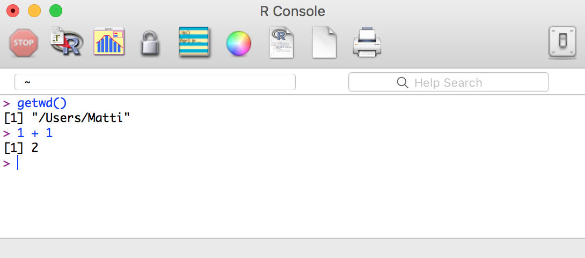
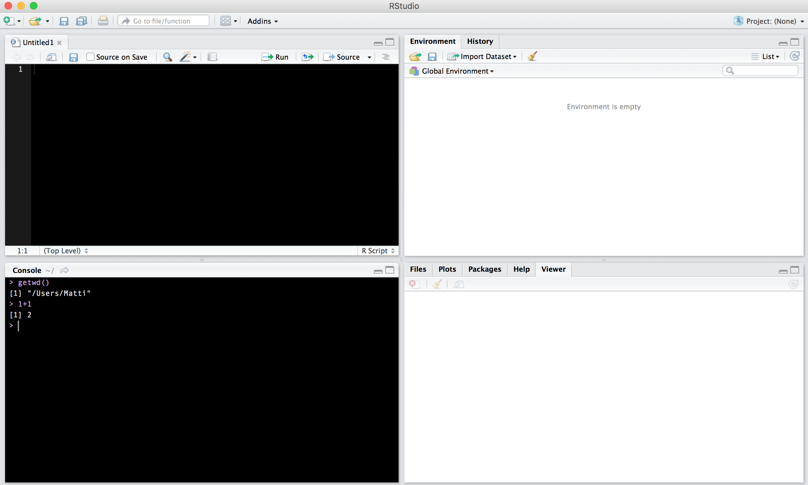
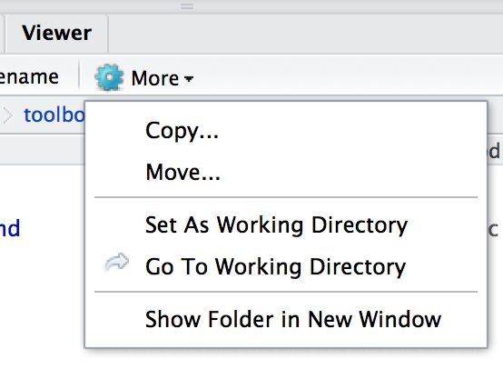
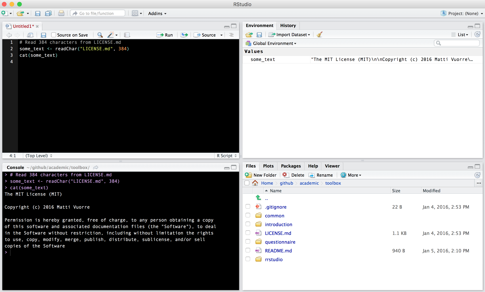

```{r, echo=F, warning=FALSE, message=FALSE}
source("common/chunk_opts.R")
```

The most basic tools in the toolbox are the programming language [__R__](https://www.r-project.org/) [@r_core_team_r:_2015], and its associated user interface, [__RStudio__](https://www.rstudio.com/) [@rstudio_team_rstudio:_2015]. We prefer these tools over alternatives, such as SPSS, Excel, or MATLAB because they are __free__. 

# R 

 is a programming language that was developed some decades ago by a bunch of statisticians in New Zealand. Because it was developed by statisticians, it is very suitable for _statistical programming_ but is also hated by programmers more familiar with general-purpose languages, such as Python. If you're not familiar with programming at all, you can think of a programming language, such as R, as something that lives in a computer, and when requested, performs computation on the input given to it. In order to give input to R, we need to open a _console_ that allows typing inputs to R. The same console also prints the outputs of the computations performed on the inputs. Pictured below is the R console, where I've asked R to _get_ the Working Directory. I then also checked if math still works.



# RStudio 

 is an _Integrated Development Environment_ for the R language. Within RStudio, we can access the R console, and more. In addition to the R console, RStudio provides a __source__ panel, an __environment__ panel, and a __viewer__ panel. Each of these panels are shown in RStudio's default view below:



## Get started with RStudio

Go ahead and open RStudio on your computer. You will see a four-panel layout similar to what I've shown above. 

The two panels on the left, which I chose to display with a black background for my aesthetic preferences, are your main "blackboard": You write commands in the __source__ panel on the top, and view output in the __console__ below. The crucial difference between these two panels is that if you type commands directly into the console, R evaluates the command but doesn't save the command itself. The source panel is a fancy text editor that allows you to type code just as you would in a text editor, but also allows you to execute the code, the results of which are then displayed in the console below. You should always write your code in the source panel, so that you will be able to save your work at the end of your coding session. To execute code in the source panel, press <kbd>Cmd + return</kbd> on the line you'd like to run.

The two panels on the right are for maintaining the working environment, displaying plots, and doing all sorts of other miscellaneous neat things. The upper right panel displays the __environment__ that will be populated with objects in your workspace. If you, for example, save a value into a variable, the variable will be displayed here.

The bottom right panel displays plots, can be used to browse files, manage packages, and view help pages. Now, we will use this panel, specifically its __Files__ tab, to set the working directory. Open the Files tab, and navigate to the root of the folder you downloaded in the [introduction chapter](introduction.html) (`toolbox/`). Then set this folder as your working directory by clicking the "More" button in the Files tab. 



R now understands that any command that refers to outside files should refer to files within this directory. For instance, we can use R to access the file `LICENSE.md` in the current working directory (don't worry about the command, but appreciate that R can access this file and print its contents):



As you can see from the image, I entered some code in the __Source__ panel, and executed each line by pressing <kbd>Cmd + enter</kbd>. The results of executing these lines then appeared in the __Console__: We read 384 characters from the file `LICENSE.md` into an object (`some_text`). This object was subsequently created in the environment, and is therefore visible in the __Environment__ panel. We then printed the object in the console. The __Files__ panel displays the contents of the working directory.

Equipped with this basic knowledge of R and RStudio, we can begin our first task: Installing additional R packages.

## Install packages

As I explained in the introduction, we will rely on additional packages to the R programming language. Additional packages are user-contributed "modules" containing multiple functions to make using R easier, and to prevent us from having to re-invent the wheel. Installing these packages is simple; you only need to call a few functions in R. So, with R open, enter the following commands to the console:

```{r, eval = F}
install.packages("readr")
install.packages("dplyr")
install.packages("ggplot2")
install.packages("reshape2")
```

These commands connect to the online [R package repository](https://cran.r-project.org/), then download and install the packages specified by the text strings. Specifically, we installed four packages that we will be using in our data-wrangling workflow.

* __readr__ [@wickham_readr:_2015]
    * Reading data tables with _style_
* __dplyr__ [@wickham_dplyr:_2015]
    * comprehensive framework for a data-wrangling pipeline
* __ggplot2__ [@wickham_ggplot2:_2009]
    * grammar of graphics plotting framework
* __reshape2__ [@wickham_reshaping_2007]
    * transforms data between long and wide formats


## Figure 1

R is pre-installed with easy-to-access plotting functions. To illustrate how easy it is to perform plotting in R, I create Figure 1 (again, don't worry about the code just yet):

```{r, fig.cap="The relationship between x and y."}
n <- 300
x <- seq(-3, 3, length = n)
y <- x^2 * 1 + rnorm(n)
plot(x, y)
```

Cool, right?!

With this understanding of R and RStudio, you can learn more by looking at the other tutorials in [toolbox 2.0](index.html).

# Further reading

## Books

Maindonald, J., & Braun, W. J. (2010). Data analysis and graphics using R: an example-based approach (Vol. 10). Cambridge University Press.

Peng, R. D. (2015). Exploratory Data Analysis with R. Leanpub. Retrieved from https://leanpub.com/exdata


## Websites

The Institute for Digital Research and Education at UCLA maintains a brilliant [website](http://www.ats.ucla.edu/stat/r/) with tons of R-related material. 

## Specific topics

The two best ways to get answers to specific questions about R are 1. [using a search engine](http://lmgtfy.com/?q=how+to+use+R), and 2. viewing and posting questions to [Stack Overflow](http://stackoverflow.com/questions/tagged/r).

# References
